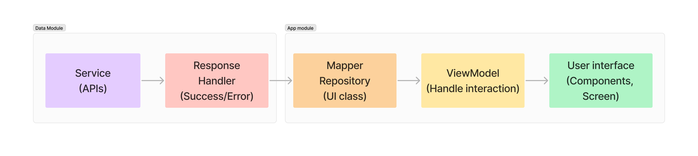

## Architecture

### Modules: Data and app
<ul>
<li><strong>Services</strong>: Call APIs, cast response to data classes</li>
<li><strong>Response Handler</strong>: Handle the retrieved data and convert error messages from exceptions</li>
<li><strong>Mapper Repository</strong>: Cast data and errors to UI classes to support UI display</li>
<li><strong>ViewModel</strong>: Handle user interaction in UI</li>
<li><strong>User Interface</strong>: Implement design system, components, screens</li>
</ul>

## Build steps
<ul>
<li><strong>Add data module</strong>: Data module is dependent module used to handle remote data</li>
<li><strong>Configure build.gradle</strong>: Add necessary dependencies for each build.gradle file. Additionally, include API_KEY and BASE_URL for Conversion APIs</li>
<li><strong>Set up design system, components</strong>: Implement classes: Font, Color. Create reusablity Composable functions: Button, TextField, Crossfade Animation</li>
<li><strong>Set up navigation</strong>: Create navigation</li>
<li><strong>Implement screens</strong>: Create screens and add UI interactions</li>
<li><strong>Intergrate conversion APIs</strong>: Set up dependency injection and call APIs functions</li>
<li><strong>Implement mapper</strong>: Create mapper class, handle errors from exceptions</li>
<li><strong>Create ViewModel</strong>: Display data from APIs on UI, handle user interactions</li>
<li><strong>Bind UI to ViewModel</strong>: Pass functions, parameters into the corresponding user interactions.</li>
</ul>

## Demo
https://github.com/user-attachments/assets/04e5c354-b49c-464f-9eb7-e323bcfdc013
